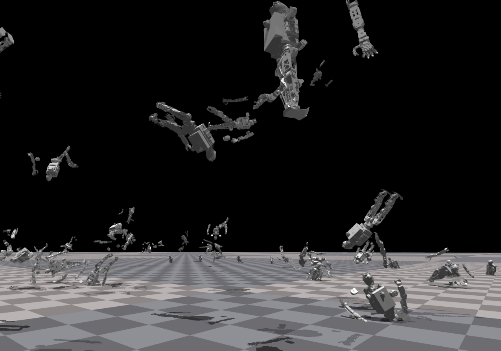

# Isaac Gym for RAI Hanumanoid Project

[](https://docs.python.org/3/whatsnew/3.7.html)
[](https://releases.ubuntu.com/20.04/)
[](https://opensource.org/licenses/BSD-3-Clause)

## Installation
using conda
```bash
./create_conda_env_rlgpu.sh

conda activate rlgpu

# 2. Enter the folder
cd IsaacGymEnvs

# 3. Install dependencies (this installs rl_games, hydra, etc.)
pip install -e .
```
## Run Training
```bash
cd IsaacGymEnvs/isaacgymenvs
python train.py task=Hanu headless=True wandb_activate=True wandb_name=HanuPPO
```
Check out the [IsaacGymEnvs](https://github.com/sincerem00n/isaacgym/tree/main/IsaacGymEnvs#running-the-benchmarks)

## Troubleshooting
1. Touch Conflict Due to Ubuntu 22.04
    reinstall touch -> use supported version 
The most reliable configuration for Isaac Gym (Preview 4) on Ubuntu 22.04 is PyTorch 1.13.1. It is stable and includes the correct MKL binaries.


Please refer to docs/index.html to get started.